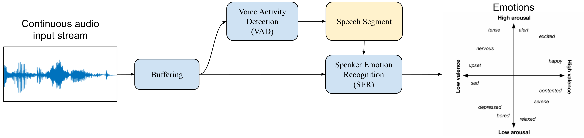

# Real-Time Emotion Recognition from Speech

## Overview

**Buffering**: Saves the last x seconds (x being an arbitrary number) to a file. Then all the other modules are performed based on the "buffered" audio file. 

**Voice Activity Detection (VAD)**: Detects speech segment and saves them.

**Speaker Emotion Recognition (SER)**: Detects emotion (arousal or valence) for each detected speech segment.

In case of any questions please send an email to [sina.alisamir@gmail.com](mailto:sina.alisamir@gmail.com)


## Installation

Please follow the instructions below (depending on your machine, you might need to change some lines):

```bash
conda create -n "EmoDemoV2" python=3
conda activate EmoDemoV2
conda install -c anaconda pyaudio=0.2.11
conda install pytorch==1.6.0 cudatoolkit=10.1 -c pytorch # Please match the cuda version with the one installed on your machine
# if cuda is not available on your machine: conda install pytorch==1.6.0 cpuonly -c pytorch
# install fairseq to use wav2vec2 models (ONLY IF CUDA IS AVAILABLE ON YOUR MACHINE)
git clone https://github.com/pytorch/fairseq
cd fairseq
pip install --editable ./
############ 
conda install -c conda-forge pydub=0.25.1
conda install -c conda-forge pysoundfile=0.9.0
conda install -c conda-forge matplotlib=3.2.2
pip install python_speech_features==0.6.0
conda install -c anaconda scipy=1.6.2
conda install -c conda-forge speechrecognition=3.7.1
```

## Emotion prediction probability from a file 

```python
file_path = "a path to a wav path with sampling rate of 16khz"
SERmodelPath="./Models/valence_MFB_standardized_GRU_32-1_0/model.pth"
SERModule = SER_Module(modelPath=SERmodelPath, device="cpu")
serOuts = SER(savePathBuffer, SERModule, device=device, outputFolder="./outputs")
```

## Running the demo

In order to run the demo, please first open `main.py` file and set your parameters, and then run the following commands:

```bash
conda activate EmoDemoV2
python main.py -s "Session_0"
```

Main parameters in `main.py` are `VADmodelPath` and `SERmodelPath`, which refer to the models used for VAD and SER modules respectively. In case of using `wav2vec2` models for feature extraction, the path to those models should also be correctly indicated. In order to observe the performance of different module in real time:

```bash
conda activate EmoDemoV2
python plot_vad.py -s "Session_0" # To observe VAD module in action
python plot_ser.py -s "Session_0" # To observe SER module in action
```
